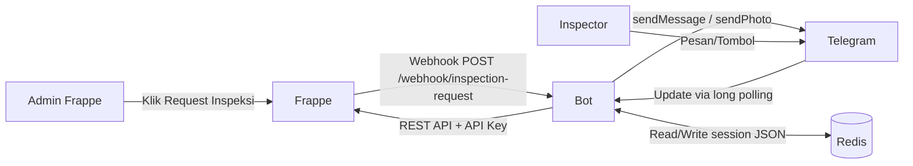
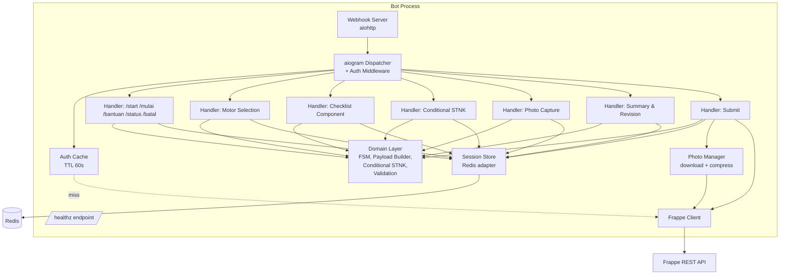
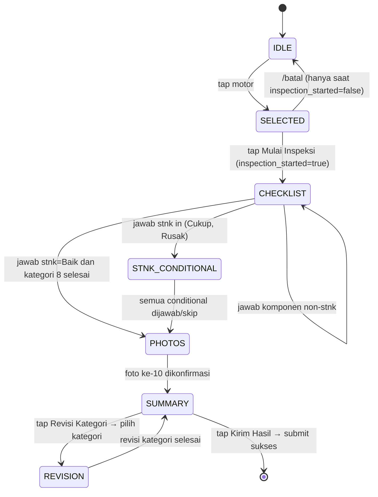

# Design Document — Telegram Inspection Bot

## Overview

Telegram Inspection Bot adalah middleware Python async (aiogram + aiohttp) yang menjembatani Custom App Frappe ERPNext dengan inspektor lapangan melalui Telegram. Bot menerima trigger dari Frappe via webhook, memandu inspektor menyelesaikan checklist 66 komponen wajib + maks. 4 pertanyaan conditional STNK dan 10 foto wajib, lalu mengirim hasil ke Frappe melalui REST API.

Tujuan desain ini:

- Menjaga konsistensi data: setiap submit menghasilkan payload `komponen` yang valid sesuai kontrak Requirement 14.
- Memberikan resiliensi: progress disimpan di Redis dengan TTL 24 jam, retry otomatis untuk submit, dan idempotensi terhadap duplikat webhook/submit.
- Menjaga UX deterministik: pemisahan **Reply Keyboard** (input jawaban) dan **Inline Keyboard** (navigasi) sesuai Requirement 16.
- Memudahkan property-based testing: logika domain (state machine sesi, evaluasi conditional STNK, builder payload, validasi pra-submit) ditulis sebagai pure function yang dapat diuji terpisah dari I/O.

Lingkup: komponen Bot saja. Implementasi sisi Frappe (custom app, doctype, server script, hooks) berada di luar lingkup dokumen ini dan diasumsikan tersedia sesuai `API_DOCUMENTATION.md`.

### Keputusan Desain Tingkat Tinggi

| Topik | Keputusan | Alasan |
|---|---|---|
| Bahasa & framework | Python 3.11 + aiogram 3.x | Konsisten dengan PRD; ekosistem matang untuk Telegram async |
| HTTP server (webhook + healthz) | aiohttp (sudah dipakai aiogram) | Hindari dependency tambahan |
| Session store | Redis (single instance) | TTL native, latensi rendah, sederhana |
| Serialisasi sesi | JSON tunggal di Redis key `session:{telegram_id}:{motor_tarikan}` | Atomik per write, mudah diaudit |
| Conversation flow | FSM eksplisit di kode (state enum) — bukan aiogram FSM bawaan | Lebih mudah ditest sebagai pure function |
| HTTP client ke Frappe | `aiohttp.ClientSession` dengan timeout 30 s | Sesuai Requirement 11.4 |
| Photo compression | Pillow (JPEG, downscale longest edge ke 1920 px lalu quality stepping) | Kompresi reproducible |
| Logging | `structlog` dengan JSON output ke STDOUT | Sesuai Requirement 13.6 |
| Konfigurasi | `pydantic-settings` membaca env | Validasi tipe + fail-fast saat startup (Requirement 12.2) |
| Auth cache | In-memory TTLCache 60 s | Sesuai Requirement 2.7 |
| Containerization | Docker, satu container, run di host yang sama dengan Frappe | Sesuai PRD §4.2 |

## Architecture

### Diagram Konteks



### Diagram Komponen Internal



### Lapisan dan Tanggung Jawab

| Lapisan | Modul | Tanggung Jawab |
|---|---|---|
| Edge | `webhook.py`, `bot_runner.py` | Menerima HTTP webhook dari Frappe; mengelola long polling / setWebhook Telegram; expose `/healthz` |
| Middleware | `auth_middleware.py` | Validasi tiap update Telegram terhadap Frappe; cache hasil otorisasi |
| Handler | `handlers/*.py` | Routing pesan → state, render UI (Reply/Inline Keyboard), tulis ke session |
| Domain (pure) | `domain/fsm.py`, `domain/checklist.py`, `domain/stnk.py`, `domain/payload.py`, `domain/validation.py`, `domain/progress.py` | Logika murni: transisi state, evaluasi pertanyaan berikutnya, conditional STNK, builder payload submit, validasi |
| Adapter | `adapters/frappe.py`, `adapters/redis_store.py`, `adapters/photos.py`, `adapters/telegram.py` | Wrapper I/O: HTTP, Redis, Telegram, photo download+compress |
| Config | `config.py` | Membaca env, gagal start jika field wajib hilang |
| Observability | `logging.py` | Setup structlog JSON; helper untuk audit event |

Aturan dependensi: handler boleh memanggil Domain dan Adapter; Domain TIDAK boleh import Adapter (uni-direksional). Ini menjadikan Domain pure dan testable lewat property tests.

### Alur Webhook → Notifikasi (Fase 1)

```mermaid
sequenceDiagram
    participant F as Frappe
    participant W as Webhook Server (aiohttp)
    participant R as Redis
    participant T as Telegram API
    F->>W: POST /webhook/inspection-request {event, motor_tarikan, ...}
    W->>W: Validasi shared secret + field wajib
    alt event != "inspection_requested"
        W-->>F: 400 "Unknown event"
    else missing inspector_chat_id / motor_tarikan
        W-->>F: 400 "Missing field: ..."
    else valid
        W->>R: SADD pending:{chat_id} motor_tarikan; EXPIRE 86400
        W->>T: sendMessage(chat_id, notif text)
        alt sendMessage gagal
            W->>W: log WARNING (jangan rollback Redis)
        end
        W-->>F: 200 OK
    end
```

### Alur Inspeksi (Fase 1.5 – 4)

```mermaid
sequenceDiagram
    participant I as Inspector
    participant B as Bot Handler
    participant Auth as AuthMiddleware
    participant R as Redis
    participant FR as Frappe
    I->>B: /mulai
    B->>Auth: validate(telegram_id)
    Auth->>FR: get_pending_list(telegram_id) (cache miss)
    FR-->>Auth: 200 ok=true data=[...]
    Auth-->>B: ok
    B->>FR: get_pending_list(telegram_id) (refresh list)
    FR-->>B: data=[...]
    B->>R: SET pending:{tid} = data
    B-->>I: Inline Keyboard daftar motor
    I->>B: tap motor
    B->>R: SET session:{tid}:{motor_id} (mode=inspeksi, motor_id, ...)
    B-->>I: Kartu konfirmasi + [Mulai Inspeksi]
    I->>B: tap Mulai Inspeksi
    loop Per komponen
        B-->>I: pertanyaan + Reply Keyboard
        I->>B: jawaban
        B->>R: SET session (answers[field]=value, advance pointer)
        B-->>I: pertanyaan berikutnya
    end
    Note over B,I: STNK conditional dievaluasi via domain.stnk
    loop 10 foto
        B-->>I: minta foto N + ReplyKeyboardRemove
        I->>B: foto
        B->>R: SET session (photos[field]=file_id)
        B-->>I: Inline [Konfirmasi] [Foto Ulang]
    end
    B-->>I: Ringkasan + Inline [Revisi] [Kirim Hasil]
    I->>B: Kirim Hasil
    B->>B: validate_pre_submit(session)
    loop 10 foto
        B->>FR: upload_foto(file)
        FR-->>B: file_url
    end
    B->>FR: submit_hasil_inspeksi(payload, idempotency_key)
    FR-->>B: 200 ok=true name=HI-...
    B->>R: DEL session:{tid}:{motor_id}; SREM pending:{tid} motor_id
    B-->>I: konfirmasi + (opsional) [Lihat Daftar Motor]
```

### Pemilihan Library

| Kebutuhan | Library | Versi target | Catatan |
|---|---|---|---|
| Telegram bot | `aiogram` | ^3.4 | Async-native, Reply/Inline keyboard support |
| HTTP server | `aiohttp` | ^3.9 | Sudah transitively dipakai aiogram |
| Redis client | `redis.asyncio` | ^5.0 | Async client resmi |
| HTTP client (Frappe) | `aiohttp.ClientSession` | — | Reuse |
| Image processing | `Pillow` | ^10.x | Resize + JPEG quality |
| Config | `pydantic-settings` | ^2.x | Fail-fast env validation |
| Logging | `structlog` | ^24.x | JSON ke STDOUT |
| Cache otorisasi | `cachetools.TTLCache` | ^5.x | In-memory, single-process |
| Property tests | `hypothesis` | ^6.x | Untuk Correctness Properties |
| Unit tests | `pytest`, `pytest-asyncio` | — | |
| Mock HTTP | `aresponses` atau `respx` | — | |

## Components and Interfaces

### 1. Konfigurasi (`config.py`)

```python
class Settings(BaseSettings):
    frappe_url: HttpUrl
    frappe_api_key: SecretStr
    frappe_api_secret: SecretStr
    telegram_bot_token: SecretStr
    redis_url: str
    redis_ttl: int = 86400
    webhook_host: str = "0.0.0.0"
    webhook_port: int = 8443
    webhook_shared_secret: SecretStr | None = None  # warn jika tidak diset
    auth_cache_ttl_seconds: int = 60
    frappe_request_timeout_seconds: int = 30
    photo_max_bytes: int = 5 * 1024 * 1024
    photo_compress_target_longest_edge: int = 1920
    log_level: str = "INFO"
```

- Membaca dari `.env` atau env proses.
- `model_post_init` memeriksa skema HTTPS (Requirement 12.5) dan log peringatan jika non-HTTPS.
- Gagal start jika field wajib tidak terset (Requirement 12.2). Pesan error tidak menyebut nilai.

### 2. Webhook Server (`webhook.py`)

Endpoint:

| Method | Path | Behavior |
|---|---|---|
| POST | `/webhook/inspection-request` | Validasi → update Redis → notif Telegram |
| GET | `/healthz` | 200 jika Redis sehat (PING), 503 sebaliknya |

Pseudocode penanganan webhook:

```python
async def handle_inspection_webhook(request):
    if settings.webhook_shared_secret and \
       request.headers.get("X-Inspection-Webhook-Secret") != settings.webhook_shared_secret.get_secret_value():
        return web.Response(status=403, text="Forbidden")

    data = await request.json()
    if data.get("event") != "inspection_requested":
        return web.Response(status=400, text="Unknown event")

    missing = [f for f in ("motor_tarikan", "inspector_chat_id") if not data.get(f)]
    if missing:
        return web.Response(status=400, text=f"Missing field: {', '.join(missing)}")

    chat_id = str(data["inspector_chat_id"])
    motor = str(data["motor_tarikan"])

    await session_store.add_pending(chat_id, motor)  # idempotent
    log.info("inspection_requested", motor_tarikan=motor, inspector_chat_id=chat_id, ...)
    try:
        await notify_inspector(chat_id, data)
    except TelegramAPIError as e:
        log.warning("notify_failed", error=str(e), chat_id=chat_id, motor_tarikan=motor)
    return web.Response(status=200, text="OK")
```

### 3. Auth Middleware (`auth_middleware.py`)

```python
class FrappeAuthMiddleware(BaseMiddleware):
    async def __call__(self, handler, event, data):
        telegram_id = extract_telegram_id(event)
        if telegram_id is None:
            return await handler(event, data)
        try:
            ok = await self._is_authorized(telegram_id)
        except FrappeUnavailable:
            await reply(event, "Sistem sedang sibuk, silakan coba lagi sebentar.")
            return None
        if not ok:
            await reply(event, "Akses ditolak. Hubungi admin.")
            return None
        return await handler(event, data)

    async def _is_authorized(self, telegram_id: str) -> bool:
        cached = self.cache.get(telegram_id)
        if cached is not None:
            return cached
        try:
            await self.frappe.get_pending_list(telegram_id)
            self.cache[telegram_id] = True
            return True
        except FrappePermissionError:
            self.cache[telegram_id] = False
            return False
```

- Webhook tidak melewati middleware ini (Requirement 2.6).
- Cache di-invalidate via TTL 60 s (Requirement 2.7).
- HTTP 5xx / network error dilempar sebagai `FrappeUnavailable` ke handler.

### 4. Domain — Checklist & FSM (`domain/checklist.py`, `domain/fsm.py`)

#### Konstanta Kontrak (Requirement 14)

```python
CATEGORIES: tuple[Category, ...]   # 8 kategori, urutan tetap
MANDATORY_FIELDS: tuple[str, ...]  # 66 field wajib (urutan tetap, identik Requirement 14.1)
COMPONENT_OPTIONS: dict[str, tuple[str, ...]]
# default {"Baik","Cukup","Rusak"}; "bahan_bakar" → {"E","1/4","1/2","3/4","F"}
PHOTO_FIELDS: tuple[str, ...]      # 10 nama foto, urutan tetap (Requirement 6.2 / 14.4)
STNK_CONDITIONAL_BY_ANSWER: dict[str, tuple[str, ...]] = {
    "Baik": (),
    "Cukup": ("stnk_hilang_polisi", "stnk_tilang", "stnk_mati_tanggal"),
    "Rusak": ("stnk_hilang_polisi", "stnk_tilang", "stnk_ta", "stnk_mati_tanggal"),
}
```

#### Phase Enum

```python
class Phase(str, Enum):
    IDLE = "idle"                        # belum pilih motor
    SELECTED = "selected"                # motor dipilih, belum tap "Mulai Inspeksi"
    CHECKLIST = "checklist"
    STNK_CONDITIONAL = "stnk_conditional"
    PHOTOS = "photos"
    SUMMARY = "summary"
    REVISION = "revision"
```

#### Pure Functions (testable)

```python
def next_question(session: Session) -> Question | Done:
    """Diberikan session, mengembalikan pertanyaan berikutnya (komponen / conditional / done)."""

def apply_answer(session: Session, field: str, value: str) -> Session:
    """Tulis jawaban, recalc progress, advance pointer. Tidak melakukan I/O."""

def stnk_relevant_fields(stnk_value: str | None) -> tuple[str, ...]:
    """Return tuple field conditional yang relevan; () jika stnk='Baik' atau None."""

def prune_irrelevant_stnk(answers: dict, stnk_value: str | None) -> dict:
    """Hapus field conditional STNK yang tidak relevan dengan stnk_value sekarang.
    Dipanggil setelah setiap revisi STNK (Requirement 5.6) dan saat membangun payload."""
```

#### Transisi (FSM)



### 5. Domain — Payload Builder (`domain/payload.py`)

```python
def build_submit_payload(session: Session, foto_urls: dict[str, str]) -> SubmitPayload:
    """Bangun body untuk submit_hasil_inspeksi.

    - komponen: 66 field wajib + conditional STNK yang non-null SETELAH prune (Requirement 14.3)
    - foto_urls: dict 10 entry
    - tipe_inspeksi: dari session
    - motor_tarikan, telegram_id, catatan
    """

def build_idempotency_key(session: Session) -> str:
    """{telegram_id}:{motor_tarikan}:{session_started_at}. Konsisten antar retry submit yang sama."""
```

`build_submit_payload` adalah pure: input deterministik → output deterministik. Inilah anchor utama property tests.

### 6. Domain — Validation (`domain/validation.py`)

```python
def validate_pre_submit(session: Session) -> list[ValidationError]:
    """Cek 66 field komponen terisi dengan opsi yang valid; 10 foto memiliki file_id.
    Return list error (kosong = valid)."""
```

### 7. Domain — Progress (`domain/progress.py`)

```python
@dataclass(frozen=True)
class CategoryProgress:
    name: str
    done: int
    total: int

def compute_progress(session: Session) -> tuple[CategoryProgress, ...]: ...
def render_progress_bar(done: int, total: int, width: int = 10) -> str: ...
```

### 8. Adapter — Frappe Client (`adapters/frappe.py`)

```python
class FrappeClient:
    async def get_pending_list(self, telegram_id: str) -> list[MotorTarikan]:
        """GET/POST /api/method/juragan.api.inspeksi.pending.get_pending_list?telegram_id=...
        Raises FrappePermissionError / FrappeUnavailable / FrappeValidationError."""

    async def upload_foto(self, file_bytes: bytes, filename: str) -> str:
        """POST /api/method/juragan.api.inspeksi.upload.upload_foto (multipart).
        Return file_url. Doctype/docname dikosongkan."""

    async def submit_hasil_inspeksi(self, payload: SubmitPayload, *, idempotency_key: str) -> SubmitResult:
        """POST /api/method/juragan.api.inspeksi.submit.submit_hasil_inspeksi.
        Header: Authorization token + X-Idempotency-Key (best-effort).
        Retry policy untuk submit di-handle oleh caller (Requirement 8.10)."""
```

Setiap method:
- Header `Authorization: token {key}:{secret}`.
- Timeout request 30 s (Requirement 11.4).
- Mapping HTTP error → exception spesifik:
  - 403 / `PermissionError` → `FrappePermissionError`
  - 404 / `DoesNotExistError` → `FrappeNotFound`
  - 400/417 / `ValidationError` → `FrappeValidationError(message=...)` dengan parsing pesan untuk membedakan "payload tidak lengkap" vs "status sudah Selesai Inspeksi" (Requirement 8.8 vs 8.9)
  - 5xx / network error → `FrappeUnavailable`

### 9. Adapter — Redis Session Store (`adapters/redis_store.py`)

```python
class RedisSessionStore:
    async def get_session(self, telegram_id: str, motor_id: str) -> Session | None: ...
    async def save_session(self, session: Session) -> None:
        """SET session:{tid}:{mid} = json.dumps(session); EXPIRE 86400."""
    async def delete_session(self, telegram_id: str, motor_id: str) -> None: ...
    async def add_pending(self, telegram_id: str, motor_id: str) -> None:
        """SADD pending:{tid} motor_id; EXPIRE 86400 (idempotent SADD)."""
    async def remove_pending(self, telegram_id: str, motor_id: str) -> None: ...
    async def replace_pending(self, telegram_id: str, motor_ids: list[str]) -> None:
        """DEL + SADD batch + EXPIRE; refresh sumber dari Frappe."""
    async def list_pending(self, telegram_id: str) -> set[str]: ...
    async def ping(self) -> bool: ...
```

Pemilihan Redis structure:
- `pending:{tid}` → SET (idempotent SADD memenuhi Requirement 1.8 / 9.2).
- `session:{tid}:{mid}` → STRING (JSON tunggal) untuk read/write atomik per session (Requirement 9.4).

Serialisasi: `Session` adalah `pydantic` model → `model_dump_json()` / `model_validate_json()` round-trip stabil (anchor untuk Property: round-trip serialisasi sesi).

### 10. Adapter — Photo Manager (`adapters/photos.py`)

```python
async def download_telegram_photo(file_id: str) -> bytes: ...

def compress_if_needed(image_bytes: bytes, *, max_bytes: int, longest_edge: int) -> bytes:
    """Jika > max_bytes: open dengan Pillow, downscale longest edge ke `longest_edge`,
    re-encode JPEG quality stepping (90 → 75 → 60) sampai <= max_bytes.
    Pure function (deterministic untuk input identik)."""
```

### 11. Handler Layer

Tiap handler bertanggung jawab:
1. Memuat session dari Redis (atau membuat baru).
2. Memanggil fungsi domain untuk menghitung state berikutnya / next question.
3. Menulis session yang diperbarui ke Redis SEBELUM mengirim pesan ke Telegram (Requirement 4.6: penyimpanan harus sukses dulu sebelum advance).
4. Mengirim pesan dengan keyboard yang sesuai aturan Requirement 16.

Tabel ringkas:

| Handler | Trigger | Output Keyboard |
|---|---|---|
| `cmd_start` | `/start` | Inline `[Lihat Daftar Motor]` |
| `cmd_mulai` / `tap_lihat_daftar` | `/mulai` atau callback | Inline list motor / pesan kosong |
| `cb_motor_selected` | callback `motor:{id}` | Inline `[Mulai Inspeksi]`; jika sesi aktif: `[Lanjutkan]` `[Mulai Ulang]` |
| `cb_mulai_inspeksi` | callback | Reply Keyboard pertanyaan komponen pertama |
| `on_text_answer_komponen` | text saat phase=CHECKLIST | Reply Keyboard pertanyaan berikutnya / transisi |
| `on_text_answer_stnk_cond` | text saat phase=STNK_CONDITIONAL | Reply Keyboard berikutnya |
| `on_photo` | `Message(photo)` saat phase=PHOTOS | Inline `[Konfirmasi]` `[Foto Ulang]` |
| `cb_photo_confirm` / `cb_photo_retry` | callback | next photo prompt + ReplyKeyboardRemove |
| `cb_revisi_kategori` | callback | Inline list kategori |
| `cb_kategori_selected` | callback | Reply Keyboard komponen pertama kategori |
| `cb_kirim_hasil` | callback | progress message → konfirmasi |
| `cmd_status` / `cmd_bantuan` | command | Inline / no keyboard |
| `cmd_batal` | command | hanya jika `inspection_started=false` |

Webhook adalah handler terpisah pada aiohttp app, bukan via aiogram dispatcher.

### 12. Submission Pipeline

```python
async def submit_inspection(session: Session) -> SubmitResult:
    errors = validate_pre_submit(session)
    if errors:
        raise PreSubmitValidationError(errors)

    # 1) Refresh tipe_inspeksi check (Requirement 14.5)
    pending = await frappe.get_pending_list(session.telegram_id)
    motor = next((m for m in pending if m.name == session.motor_id), None)
    if motor is None:
        raise StatusChanged()  # akan dihandle: pesan "sudah dialihkan"
    expected_tipe = "Inspeksi Ulang" if motor.status_inspeksi == "Proses Inspeksi Ulang" else "Inspeksi"
    if expected_tipe != session.tipe_inspeksi:
        raise StatusMismatch()

    # 2) Upload 10 foto serial (Requirement 8.3)
    foto_urls: dict[str, str] = {}
    for field in PHOTO_FIELDS:
        file_id = session.photos[field]
        raw = await download_telegram_photo(file_id)
        compressed = compress_if_needed(raw, max_bytes=settings.photo_max_bytes, longest_edge=1920)
        url = await frappe.upload_foto(compressed, filename=f"{field}_{session.motor_id}.jpg")
        foto_urls[field] = url

    # 3) Build payload (pure)
    payload = build_submit_payload(session, foto_urls)
    idem_key = build_idempotency_key(session)

    # 4) Submit dengan retry (Requirement 8.10)
    backoffs = (2, 4, 8)
    last_exc = None
    for attempt in range(4):
        try:
            return await frappe.submit_hasil_inspeksi(payload, idempotency_key=idem_key)
        except FrappeValidationError as e:
            if e.indicates_already_completed():  # Requirement 8.9
                return SubmitResult.synthetic_success_already_completed()
            raise
        except (FrappeUnavailable,) as e:
            last_exc = e
            if attempt < 3:
                await asyncio.sleep(backoffs[attempt])
            else:
                raise
```

Pemanggil (handler `cb_kirim_hasil`) menafsirkan exception → pesan ke inspektor sesuai Requirement 8.

## Data Models

### Session (Redis JSON)

`Session` adalah pydantic model. Key Redis: `session:{telegram_id}:{motor_id}`. TTL 86400 s, di-refresh setiap save (Requirement 9.1).

```python
class Session(BaseModel):
    schema_version: int = 1
    telegram_id: str
    motor_id: str
    tipe_inspeksi: Literal["Inspeksi", "Inspeksi Ulang"]
    inspection_started: bool = False
    started_at: datetime | None = None       # ISO 8601, set saat inspection_started → true
    mode: Literal["inspeksi", "revisi", "ringkasan"] = "inspeksi"
    phase: Phase = Phase.SELECTED
    current_category: str | None = None      # nama kategori, salah satu dari CATEGORIES
    current_question: str | None = None      # field name yang sedang aktif
    answers: dict[str, str | None] = {}      # field → value (None = skipped conditional)
    stnk_answer: Literal["Baik", "Cukup", "Rusak"] | None = None
    photo_index: int = 0
    photos: dict[str, str] = {}              # photo_field → telegram file_id
    completed_categories: list[str] = []     # urutan terurut, unik
    progress: dict[str, CategoryProgress] = {}  # name → CategoryProgress
    revision_history: dict[str, datetime] = {}  # nama_kategori → ISO 8601
    revisi_kategori: str | None = None       # aktif hanya saat mode = "revisi"
    motor_meta: MotorMeta                     # snapshot data motor saat dipilih (nopol, merk, ...)
```

Invarian (akan dijaga oleh fungsi domain dan diuji property-based):

- `0 <= photo_index <= 10`.
- `set(answers.keys()) ⊆ set(MANDATORY_FIELDS) ∪ set(STNK_CONDITIONAL_FIELDS)`.
- Jika `stnk_answer == "Baik"`, semua key conditional STNK tidak ada di `answers` (Requirement 5.7).
- Jika `mode == "revisi"`, maka `revisi_kategori is not None`.
- `completed_categories` ⊆ `CATEGORIES` (urutan = subseq dari urutan kategori).

### Pending Queue (Redis SET)

- Key: `pending:{telegram_id}`.
- Anggota: `motor_id` (string).
- TTL: 86400 s.
- Invarian: tidak ada duplikat (set semantics).

### MotorTarikan (response Frappe)

```python
class MotorTarikan(BaseModel):
    name: str          # mis. "PJ-001"
    nopol: str
    merk: str
    model: str
    tahun: str
    warna: str
    status_inspeksi: Literal["Proses Inspeksi", "Proses Inspeksi Ulang"]
```

### MotorMeta (di session)

Snapshot subset MotorTarikan saat motor dipilih, agar handler tidak perlu re-fetch terus-menerus.

```python
class MotorMeta(BaseModel):
    name: str; nopol: str; merk: str; model: str; tahun: str; warna: str
```

### SubmitPayload

```python
class SubmitPayload(BaseModel):
    motor_tarikan: str
    telegram_id: str
    tipe_inspeksi: Literal["Inspeksi", "Inspeksi Ulang"]
    komponen: dict[str, str]   # 66 wajib + conditional non-null
    foto_urls: dict[str, str]  # 10 entries
    catatan: str | None = None
```

Aturan pembentukan `komponen` (Requirement 14.3):

```text
komponen = { f: answers[f] for f in MANDATORY_FIELDS }
if stnk_answer in ("Cukup", "Rusak"):
    for f in STNK_CONDITIONAL_BY_ANSWER[stnk_answer]:
        v = answers.get(f)
        if v is not None:
            komponen[f] = v
# stnk_answer == "Baik" → tidak menyertakan field conditional apapun
```

### Question (untuk handler)

```python
@dataclass(frozen=True)
class Question:
    field: str
    label: str            # human-readable
    options: tuple[str, ...]   # untuk Reply Keyboard; () untuk free-text date
    keyboard_kind: Literal["reply", "free_text_with_skip"]
    skippable: bool
```

### ValidationError

```python
@dataclass(frozen=True)
class ValidationError:
    field: str
    reason: Literal["missing", "invalid_value", "missing_photo"]
    message: str
```

### Audit Log Event Schema

Output STDOUT JSON satu baris per entri (Requirement 13):

```json
{
  "ts": "2025-01-13T08:42:11Z",
  "level": "INFO",
  "event_type": "INSPECTION_REQUESTED" | "INSPECTION_STARTED" | "CATEGORY_REVISED" | "SUBMIT_SUCCESS" | "SUBMIT_FAILED" | ...,
  "telegram_id": "123456789",
  "motor_tarikan": "PJ-001",
  "tipe_inspeksi": "Inspeksi",
  "...": "field-spesifik per event"
}
```


## Correctness Properties

*A property is a characteristic or behavior that should hold true across all valid executions of a system — essentially, a formal statement about what the system should do. Properties serve as the bridge between human-readable specifications and machine-verifiable correctness guarantees.*

Properti berikut diformalkan dari acceptance criteria di `requirements.md` dan akan diimplementasikan sebagai property-based tests menggunakan Hypothesis. Setiap properti bersifat universally quantified ("for all") dan merujuk ke requirement yang divalidasi.

### Property 1: Session Serialization Round-Trip

*For any* valid `Session` instance (with arbitrary combinations of filled/empty answers, photos, phases, and revision history), serializing to JSON via `model_dump_json()` then deserializing via `model_validate_json()` SHALL produce an object equal to the original.

**Validates: Requirements 9.1, 9.3, 9.4**

### Property 2: Payload Completeness and Validity Invariant

*For any* `Session` that passes `validate_pre_submit` (returns empty error list), `build_submit_payload(session, foto_urls)` SHALL produce a `SubmitPayload` where:
- `komponen` contains exactly 66 mandatory keys (as defined in Requirement 14.1)
- Each mandatory field value belongs to its defined option set (`{"Baik","Cukup","Rusak"}` for all except `bahan_bakar` which uses `{"E","1/4","1/2","3/4","F"}`)
- Conditional STNK fields are included ONLY when `stnk_answer ∈ {"Cukup","Rusak"}` AND the field value is non-null
- `foto_urls` contains exactly 10 keys matching `PHOTO_FIELDS`
- `tipe_inspeksi ∈ {"Inspeksi", "Inspeksi Ulang"}`

**Validates: Requirements 14.1, 14.2, 14.3, 14.4, 8.4**

### Property 3: Conditional STNK Invariant

*For any* `stnk_value ∈ {"Baik", "Cukup", "Rusak"}` and any `answers` dict containing arbitrary conditional STNK fields:
- `stnk_relevant_fields("Baik")` returns `()`
- `stnk_relevant_fields("Cukup")` returns exactly `("stnk_hilang_polisi", "stnk_tilang", "stnk_mati_tanggal")`
- `stnk_relevant_fields("Rusak")` returns exactly `("stnk_hilang_polisi", "stnk_tilang", "stnk_ta", "stnk_mati_tanggal")`
- After `prune_irrelevant_stnk(answers, stnk_value)`, no key in the result belongs to a conditional field that is NOT in `stnk_relevant_fields(stnk_value)`
- The pruned result preserves all non-conditional keys unchanged

**Validates: Requirements 5.1, 5.2, 5.3, 5.6, 5.7**

### Property 4: Webhook Idempotency

*For any* valid webhook payload and any `N ≥ 1`, processing the same payload `N` times SHALL result in `pending_motors` (as a set) being identical to processing it exactly once. The set SHALL contain the `motor_tarikan` from the payload.

**Validates: Requirements 1.2, 1.8**

### Property 5: Revision Confluence

*For any* two distinct orderings of category revisions that produce the same final `answers` dict, `build_submit_payload` SHALL produce identical `komponen` dicts. That is, the payload depends only on the final answer values, not on the order in which revisions were applied.

**Validates: Requirement 7 (general confluence)**

### Property 6: Progress Monotonicity

*For any* sequence of `apply_answer` calls in mode `"inspeksi"` (non-revision), the cumulative `done` count (sum of answered mandatory fields) SHALL be non-decreasing. In mode `"revisi"`, `done` for the revised category SHALL never exceed `total` for that category.

**Validates: Requirements 4.7, 7.6**

### Property 7: Pending Sync Invariant

*For any* Frappe `get_pending_list` response (a list of motor IDs) and any prior `pending_motors` set in Redis, after `replace_pending(telegram_id, response_motor_ids)`, the resulting pending set SHALL equal exactly the set of motor IDs from the Frappe response. Motors previously in pending but absent from the response SHALL be removed.

**Validates: Requirements 3.7, 15.1**

### Property 8: Keyboard Type Invariant per Phase

*For any* valid session state:
- When `phase ∈ {CHECKLIST, STNK_CONDITIONAL}` or `mode == "revisi"`, the bot message SHALL use Reply Keyboard (not Inline Keyboard) for answer input
- When `phase ∈ {IDLE, SELECTED, PHOTOS, SUMMARY}` and `mode != "revisi"`, the bot message SHALL use Inline Keyboard (not Reply Keyboard) for navigation actions
- Transition from a Reply Keyboard phase to a non-Reply Keyboard phase SHALL include `ReplyKeyboardRemove`

**Validates: Requirements 16.1, 16.2, 16.4, 16.5, 4.10**

### Property 9: Answer Validation

*For any* component field `f` in `MANDATORY_FIELDS` and any string `v`:
- If `v ∈ COMPONENT_OPTIONS[f]`, then `apply_answer(session, f, v)` SHALL accept the answer and advance the pointer
- If `v ∉ COMPONENT_OPTIONS[f]`, then the answer SHALL be rejected and the session SHALL remain unchanged (same `current_question`, same `answers`)

**Validates: Requirements 4.4, 4.5, 4.8, 16.6**

### Property 10: Next Question Ordering

*For any* session in phase `CHECKLIST` with `N` answers already recorded (0 ≤ N < 66), `next_question(session)` SHALL return the `(N+1)`-th field in `MANDATORY_FIELDS` (0-indexed). The ordering is deterministic and matches the category order defined in Requirement 4.1.

**Validates: Requirements 4.1, 4.2**

### Property 11: Idempotency Key Determinism

*For any* `Session` instance, `build_idempotency_key(session)` SHALL always return the same string value. Specifically, for two sessions with identical `telegram_id`, `motor_id`, and `started_at`, the idempotency key SHALL be identical regardless of differences in `answers`, `photos`, or other mutable fields.

**Validates: Requirement 8.7**

### Property 12: Photo Compression Bound

*For any* image byte sequence with length > `max_bytes`, `compress_if_needed(image_bytes, max_bytes=5*1024*1024, longest_edge=1920)` SHALL return a byte sequence with length ≤ `max_bytes`. For any image byte sequence with length ≤ `max_bytes`, the function SHALL return the input unchanged (identity).

**Validates: Requirement 6.8**

### Property 13: Revision Answer Semantics

*For any* field `f` with existing answer `old_value` in a session in revision mode:
- Applying `Skip` SHALL preserve `answers[f] == old_value`
- Applying a new valid value `new_value ≠ old_value` SHALL result in `answers[f] == new_value`

*For any* completed category revision, `revision_history` SHALL contain an entry for that category with a valid ISO 8601 timestamp.

**Validates: Requirements 7.4, 7.5, 7.6**

### Property 14: Cancel Guard Condition

*For any* session where `inspection_started == True`, the `/batal` command SHALL be rejected (no state change). *For any* session where `inspection_started == False`, the `/batal` command SHALL clear the motor selection without modifying `pending_motors`.

**Validates: Requirements 10.5, 10.6**

## Error Handling

### Strategi Error per Lapisan

| Lapisan | Sumber Error | Penanganan |
|---|---|---|
| Webhook Server | Payload tidak valid | HTTP 400 + body deskriptif; tidak ubah Redis |
| Webhook Server | Telegram API gagal kirim notif | Log WARNING; tetap return 200 (Req 1.6) |
| Auth Middleware | Frappe 403 / PermissionError | Pesan "Akses ditolak" ke user; hentikan handler |
| Auth Middleware | Frappe 5xx / network error | Pesan "Sistem sedang sibuk" ke user; hentikan handler |
| Handler | Redis read/write gagal | Pesan "Gagal menyimpan jawaban, silakan coba lagi" (Req 4.6, 9.5); tidak advance state |
| Handler | Session expired / tidak ditemukan | Pesan "Sesi inspeksi telah berakhir. Silakan ketik /mulai" (Req 9.6) |
| Handler | Input tidak valid (bukan opsi) | Re-display pertanyaan + Reply Keyboard (Req 4.5) |
| Submit Pipeline | Pre-submit validation gagal | Tampilkan field/foto kosong; kembali ke Ringkasan (Req 8.2) |
| Submit Pipeline | Upload foto gagal (single) | Abort submit; pesan error; session dipertahankan |
| Submit Pipeline | Frappe 417 "payload tidak lengkap" | Pesan error; kembali ke Ringkasan (Req 8.8) |
| Submit Pipeline | Frappe 417 "Selesai Inspeksi" | Treat as success; hapus session (Req 8.9) |
| Submit Pipeline | Frappe 403 | Pesan "Akses ditolak untuk motor ini"; hapus session (Req 15.3) |
| Submit Pipeline | Frappe 5xx / network | Retry 3× backoff 2s/4s/8s; jika semua gagal: pesan retry manual (Req 8.10) |
| Submit Pipeline | Motor sudah di-reassign | Pesan "Motor ini sudah dialihkan"; hapus session (Req 15.2) |

### Exception Hierarchy

```python
class InspectionBotError(Exception): ...

class FrappeError(InspectionBotError): ...
class FrappePermissionError(FrappeError): ...
class FrappeNotFound(FrappeError): ...
class FrappeValidationError(FrappeError):
    def indicates_already_completed(self) -> bool: ...
    def indicates_payload_incomplete(self) -> bool: ...
class FrappeUnavailable(FrappeError): ...

class SessionError(InspectionBotError): ...
class SessionExpired(SessionError): ...
class SessionNotFound(SessionError): ...

class ValidationError(InspectionBotError):
    field: str
    reason: str

class PreSubmitValidationError(InspectionBotError):
    errors: list[ValidationError]

class StatusChanged(InspectionBotError): ...
class StatusMismatch(InspectionBotError): ...
```

### Prinsip Error Handling

1. **Fail-safe**: Jika ragu, jangan hapus session. Lebih baik inspektor retry daripada kehilangan progress.
2. **User-facing messages**: Selalu dalam Bahasa Indonesia, singkat, actionable.
3. **No secret leakage**: Error log tidak pernah menyertakan API key/secret/token values.
4. **Idempotent recovery**: Setiap error state memungkinkan inspektor mencoba ulang tanpa side effect duplikat.
5. **Graceful degradation**: Jika Frappe down, bot tetap bisa merespons dengan pesan sibuk (tidak crash).

### Timeout dan Retry Policy

| Operasi | Timeout | Retry | Backoff |
|---|---|---|---|
| Frappe `get_pending_list` | 30 s | 0 (langsung pesan sibuk) | — |
| Frappe `upload_foto` | 30 s | 0 (abort submit) | — |
| Frappe `submit_hasil_inspeksi` | 30 s | 3 | Exponential: 2s, 4s, 8s |
| Redis read/write | 5 s | 0 (pesan gagal) | — |
| Telegram sendMessage | 10 s | 0 (log warning) | — |

## Testing Strategy

### Pendekatan Dual Testing

Testing dibagi menjadi dua track komplementer:

1. **Property-Based Tests (Hypothesis)** — Memvalidasi 14 correctness properties di atas dengan minimum 100 iterasi per property. Fokus pada domain layer (pure functions).
2. **Unit Tests (pytest + pytest-asyncio)** — Memvalidasi contoh spesifik, edge cases, error handling, dan integrasi antar komponen dengan mock.

### Property-Based Testing (Hypothesis)

**Library**: `hypothesis` ^6.x
**Runner**: `pytest` dengan plugin `hypothesis`
**Minimum iterations**: 100 per property (default Hypothesis settings)
**Tag format**: `# Feature: telegram-inspection-bot, Property {N}: {title}`

#### Target Modules untuk PBT

| Module | Properties yang Diuji |
|---|---|
| `domain/payload.py` | Property 2 (Payload Completeness), Property 5 (Confluence) |
| `domain/checklist.py` | Property 6 (Progress Monotonicity), Property 9 (Answer Validation), Property 10 (Next Question Ordering) |
| `domain/stnk.py` | Property 3 (Conditional STNK Invariant) |
| `domain/fsm.py` | Property 8 (Keyboard Type), Property 14 (Cancel Guard) |
| `domain/validation.py` | Property 2 (via validate_pre_submit) |
| `adapters/redis_store.py` | Property 1 (Session Round-Trip) — via Session model |
| `adapters/photos.py` | Property 12 (Compression Bound) |
| `webhook.py` | Property 4 (Webhook Idempotency) — via mock Redis |
| `domain/payload.py` | Property 11 (Idempotency Key) |

#### Custom Hypothesis Strategies

```python
# Contoh strategy untuk Session yang valid (lulus pre-submit)
@st.composite
def valid_complete_session(draw):
    """Generate a Session with all 66 mandatory answers filled and 10 photos."""
    answers = {f: draw(st.sampled_from(COMPONENT_OPTIONS[f])) for f in MANDATORY_FIELDS}
    stnk_val = answers["stnk"]
    # Add conditional STNK answers if relevant
    for f in stnk_relevant_fields(stnk_val):
        if f == "stnk_mati_tanggal":
            answers[f] = draw(st.dates().map(lambda d: d.isoformat()))
        else:
            answers[f] = draw(st.sampled_from(["Ya", "Tidak"]))
    photos = {f: draw(st.text(min_size=10, max_size=50)) for f in PHOTO_FIELDS}
    # ... build Session with these answers and photos
    return session

@st.composite
def arbitrary_session(draw):
    """Generate a Session in any valid state (partial or complete)."""
    phase = draw(st.sampled_from(Phase))
    # ... fill fields appropriate for phase
    return session

@st.composite
def webhook_payload(draw):
    """Generate a valid webhook payload."""
    return {
        "event": "inspection_requested",
        "motor_tarikan": draw(st.text(min_size=1, max_size=20, alphabet=st.characters(whitelist_categories=("L", "N")))),
        "inspector_chat_id": draw(st.text(min_size=1, max_size=15, alphabet="0123456789")),
        "nopol": draw(st.text(min_size=5, max_size=12)),
        "merk": draw(st.text(min_size=1, max_size=20)),
        "model": draw(st.text(min_size=1, max_size=20)),
        "tahun": draw(st.from_regex(r"[12][09]\d{2}", fullmatch=True)),
        "warna": draw(st.text(min_size=1, max_size=15)),
        "tipe_inspeksi": draw(st.sampled_from(["Inspeksi", "Inspeksi Ulang"])),
    }
```

### Unit Tests (pytest)

**Fokus unit tests**:
- Contoh spesifik untuk setiap handler (happy path + error path)
- Edge cases: session expired, Redis down, Frappe timeout
- Integration points: auth middleware flow, submit pipeline sequence
- Error message content verification
- Command routing (`/start`, `/mulai`, `/bantuan`, `/status`, `/batal`)

**Mock strategy**:
- `aresponses` atau `respx` untuk mock HTTP calls ke Frappe
- `fakeredis` untuk mock Redis (atau real Redis di CI)
- `aiogram` test utilities untuk simulating Telegram updates

### Test Organization

```
tests/
├── conftest.py                  # Shared fixtures, Hypothesis profiles
├── strategies.py                # Custom Hypothesis strategies
├── properties/
│   ├── test_session_roundtrip.py       # Property 1
│   ├── test_payload_invariant.py       # Property 2
│   ├── test_stnk_conditional.py        # Property 3
│   ├── test_webhook_idempotency.py     # Property 4
│   ├── test_revision_confluence.py     # Property 5
│   ├── test_progress_monotonicity.py   # Property 6
│   ├── test_pending_sync.py            # Property 7
│   ├── test_keyboard_invariant.py      # Property 8
│   ├── test_answer_validation.py       # Property 9
│   ├── test_next_question_order.py     # Property 10
│   ├── test_idempotency_key.py         # Property 11
│   ├── test_photo_compression.py       # Property 12
│   ├── test_revision_semantics.py      # Property 13
│   └── test_cancel_guard.py            # Property 14
├── unit/
│   ├── test_webhook_handler.py
│   ├── test_auth_middleware.py
│   ├── test_motor_selection.py
│   ├── test_checklist_handler.py
│   ├── test_stnk_handler.py
│   ├── test_photo_handler.py
│   ├── test_summary_handler.py
│   ├── test_submit_handler.py
│   ├── test_commands.py
│   └── test_config.py
└── integration/
    ├── test_frappe_client.py
    ├── test_redis_store.py
    └── test_full_flow.py
```

### CI Pipeline

1. **Lint**: `ruff check` + `mypy --strict`
2. **Unit tests**: `pytest tests/unit/ -v`
3. **Property tests**: `pytest tests/properties/ -v --hypothesis-seed=0` (deterministic CI, random locally)
4. **Integration tests**: `pytest tests/integration/ -v` (requires Redis + mock Frappe)
5. **Coverage**: target ≥ 90% line coverage pada `domain/` layer
